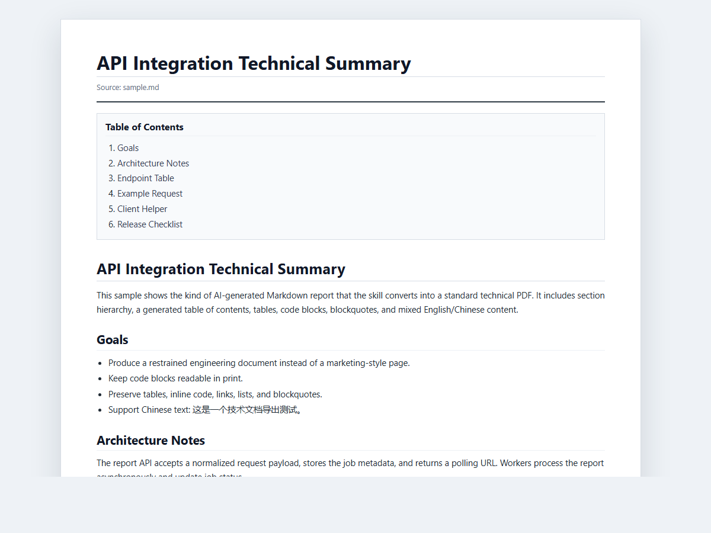
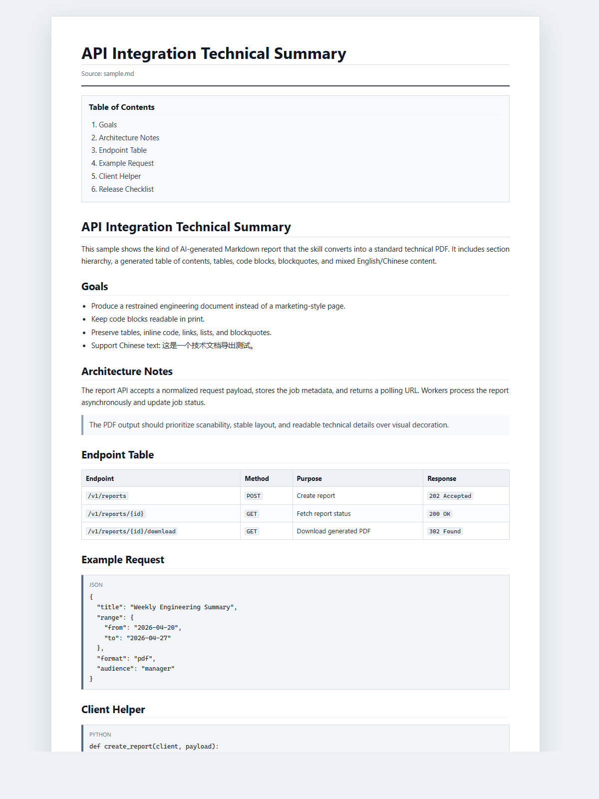

# Markdown Tech PDF Skill

Convert AI-generated Markdown summaries into polished technical PDF documents.

This repository provides a Codex-compatible skill plus an `npx` installer. It is designed for engineering reports, API summaries, architecture notes, runbooks, implementation plans, and other Markdown documents that need a clean PDF export.

## Preview



Full-page example:



## Install With npx

```bash
npx @zartt/markdown-tech-pdf
```

This copies the `markdown-tech-pdf` skill into your Codex skills directory and overwrites the previous local copy if one exists.

## Install With Vercel Skills

This repository is compatible with the Vercel `skills` CLI:

```bash
npx skills add zarttic/markdown-tech-pdf-skill
```

The CLI detects the `markdown-tech-pdf` skill from this repository and can install it for supported agents.

## What It Does

- Converts Markdown into a restrained technical-document HTML layout.
- Prints the HTML to PDF through a local Chromium-family browser such as Microsoft Edge, Google Chrome, or Chromium.
- Supports common technical Markdown: headings, lists, checklists, links, blockquotes, fenced code blocks, and pipe tables.
- Adds a title block and generated table of contents.
- Uses print-oriented CSS for A4 pages, readable code blocks, table styling, and stable spacing.
- Uses Chinese-capable system font fallbacks for mixed English and Chinese documentation.

## Example Markdown

~~~markdown
# API Integration Technical Summary

## Goals

- Produce a restrained engineering document.
- Keep code blocks readable in print.
- Support Chinese text: 这是一个技术文档导出测试。

## Endpoint Table

| Endpoint | Method | Purpose |
| --- | --- | --- |
| `/v1/reports` | `POST` | Create report |

## Client Helper

```python
def create_report(client, payload):
    return client.post("/v1/reports", json=payload)
```
~~~

## Direct Script Usage

```powershell
python ".\markdown-tech-pdf\scripts\md_to_tech_pdf.py" ".\sample.md" ".\sample.pdf" --title "Technical Report"
```

Optional HTML output:

```powershell
python ".\markdown-tech-pdf\scripts\md_to_tech_pdf.py" ".\sample.md" ".\sample.pdf" --html-output ".\sample.html"
```

## Manual Install

Copy the skill folder into your Codex skills directory:

```powershell
Copy-Item -Recurse -Force `
  ".\markdown-tech-pdf" `
  "$env:USERPROFILE\.codex\skills\markdown-tech-pdf"
```

Restart Codex after copying the folder.

## Requirements

- Python 3.10+
- Microsoft Edge, Google Chrome, or Chromium available on the machine

No Pandoc dependency is required.

## Repository Layout

```text
markdown-tech-pdf/
  SKILL.md
  agents/openai.yaml
  references/technical-document-style.md
  scripts/md_to_tech_pdf.py
docs/screenshots/
  technical-document-fold.png
  technical-document-preview.png
sample.md
```
